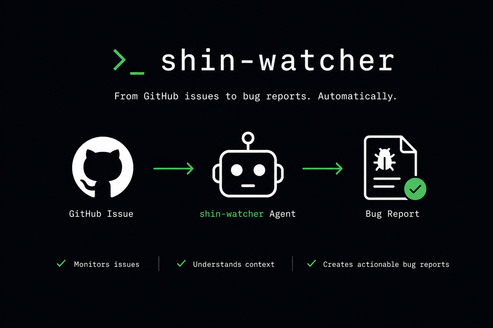

# shin-watcher



an agent that picks open LiteLLM GitHub issues, tries to reproduce them, and writes a report with a verdict score and before/after screenshots.

when `AUTO_FIX=true`, easy/medium issues also get a fix attempt and a draft PR.

## Features

- picks open issues automatically, no manual triage
- reproduces bugs via browser + curl against a live LiteLLM proxy
- scores each issue 0–5 and classifies difficulty
- posts a report comment with screenshots when `POST_COMMENTS=true`
- opens a draft fix PR when `AUTO_FIX=true`


## Setup

```bash
nvm use 20
npm install
cp .env.example .env
# fill in LITELLM_BASE_URL, LITELLM_API_KEY, GITHUB_TOKEN, GITHUB_BOT_USERNAME
```

Prerequisites: `gh` CLI (authenticated), `git`, `uv`, `ImageMagick`.

## Usage

```bash
# one-shot against a specific issue
npm run once -- --issue 9876

# continuous daemon
npm run dev
```

## Safety flags

Both default to `false` — first runs are local-only so you can review output before anything touches GitHub.

- `POST_COMMENTS` — post the report as a GitHub issue comment
- `AUTO_FIX` — attempt a fix and open a draft PR

## Verdict scores

| Score | Meaning |
|---|---|
| 5 | Fully reproduced, root cause confirmed, fix validated |
| 4 | Reproduced, root cause with file:line evidence |
| 3 | Similar symptoms, not the exact reported flow |
| 2 | Partial signal — env starts but flow didn't trigger |
| 1 | Setup failed |
| 0 | Unreproducible (missing info, feature request, question) |

## Targeting another repository

By default shin-watcher targets `BerriAI/litellm` via the `litellm` profile shipped under `profiles/litellm/`. To target a different repository, create a new profile and select it via the `PROFILE` env var.

A profile is a folder under `profiles/<name>/` containing:

| File | Purpose |
|---|---|
| `config.yaml` | Clone URL, install command, start command, env vars, health check |
| `repro.md` | The reproduction skill — instructions the agent follows to reproduce a bug |
| `prompt.md` | One-paragraph system prompt addendum that introduces the target |

Example `profiles/my-service/config.yaml`:

```yaml
name: my-service

clone_url: https://github.com/my-org/my-service.git
default_ref: main

install:
  command: npm ci

start:
  command: node ./dist/server.js --port {port}
  env:
    SERVICE_ADMIN_KEY: "{master_key}"
    SERVICE_UI_USER: "{ui_username}"
    SERVICE_UI_PASS: "{ui_password}"

health_check:
  url: http://localhost:{port}/health
  timeout_ms: 60000

ui_url: http://localhost:{port}/admin/
```

Placeholders `{port}`, `{master_key}`, `{ui_username}`, `{ui_password}` are substituted per repro run with values generated by shin-watcher.

Then set in your `.env`:

```bash
PROFILE=my-service
TARGET_REPO_OWNER=my-org
TARGET_REPO_NAME=my-service
```

Existing users targeting `BerriAI/litellm` need no change — `PROFILE` defaults to `litellm` when unset.
